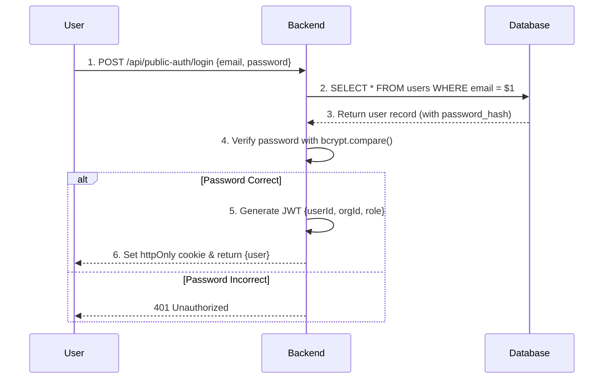
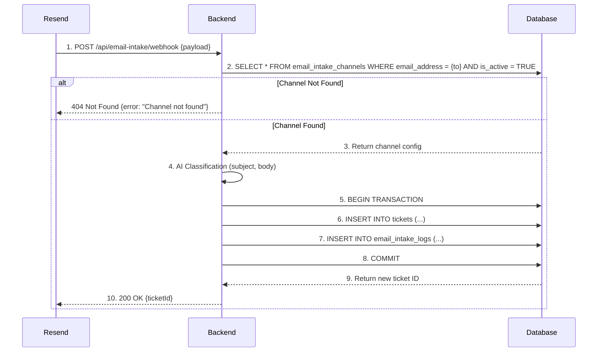
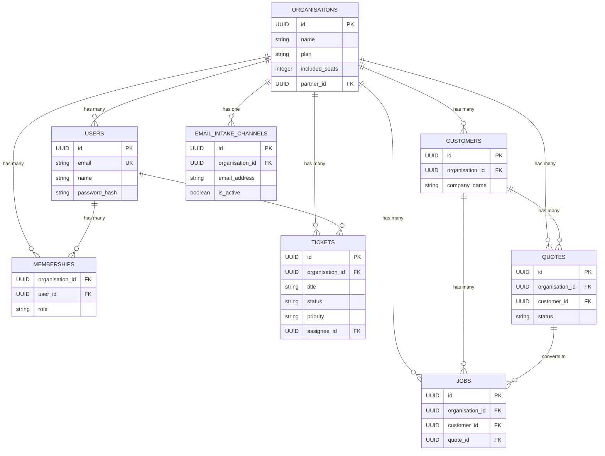

# WorkTrackr Cloud - Master Blueprint

**Version:** 5.0  
**Date:** November 10, 2025  
**Author:** Manus AI

**Purpose:** This document is the single source of truth for the complete technical architecture, database schema, and system design of the WorkTrackr Cloud platform. It consolidates all prior architecture documents and incorporates all knowledge gained during development and debugging.

---

## Table of Contents

1.  [System Architecture Overview](#1-system-architecture-overview)
2.  [Technology Stack](#2-technology-stack)
3.  [Data Flow Diagrams](#3-data-flow-diagrams)
4.  [API Architecture](#4-api-architecture)
5.  [Frontend Architecture](#5-frontend-architecture)
6.  [Database Architecture](#6-database-architecture)
7.  [Security Architecture](#7-security-architecture)
8.  [Integration Points](#8-integration-points)
9.  [Completed Work & Fixes (Nov 9-10)](#9-completed-work--fixes-nov-9-10)

---

## 1. System Architecture Overview

WorkTrackr Cloud is a multi-tenant SaaS platform built on a classic **three-tier architecture**, ensuring a clear separation of concerns between the presentation, application, and data layers.

```mermaid
graph TD
    A[Presentation Layer<br>(React Frontend)] -->|REST API<br>(HTTPS/JSON)| B(Application Layer<br>(Node.js/Express Backend));
    B -->|SQL Queries| C(Data Layer<br>(PostgreSQL Database));

    subgraph A
        direction LR
        A1[Dashboard] --~ A2[Tickets];
        A2 --~ A3[CRM];
        A3 --~ A4[Calendar];
    end

    subgraph B
        direction LR
        B1[Authentication] --~ B2[Business Logic];
        B2 --~ B3[API Endpoints];
        B3 --~ B4[Integrations];
    end

    subgraph C
        direction LR
        C1[Core Tables<br>organisations, users] --~ C2[Ticket Tables<br>tickets, comments];
        C2 --~ C3[CRM Tables<br>customers, quotes, jobs];
        C3 --~ C4[Email Intake<br>channels, logs];
    end
```

---

## 2. Technology Stack

| Layer      | Technology        | Details                                                                                             |
| :--------- | :---------------- | :-------------------------------------------------------------------------------------------------- |
| **Frontend** | React 18.2        | Vite, React Router, Tailwind CSS, shadcn/ui, Lucide Icons, Axios                                    |
| **Backend**  | Node.js 22.x      | Express.js, pg (PostgreSQL client), jsonwebtoken, bcrypt, Zod (validation)                        |
| **Database** | PostgreSQL 15     | `uuid-ossp`, `pgcrypto`, and `pg_trgm` extensions enabled                                           |
| **Infra**    | Render            | Managed PostgreSQL, Web Service (Node.js), Static Site (React)                                    |
| **Email**    | Resend            | Used for both transactional emails and the email intake webhook system                            |
| **Payments** | Stripe            | Subscription management, seat-based billing, and one-off invoice payments                       |

---

## 3. Data Flow Diagrams

### 3.1. User Authentication Flow

This flow outlines how a user logs in and maintains a session using a secure, httpOnly JWT cookie.



### 3.2. Email Intake Flow

This flow details how an incoming email is processed and converted into a ticket.



---

## 4. API Architecture

### 4.1. Design Principles

- **RESTful & Resource-Oriented:** URLs are based on resources (e.g., `/api/tickets/:id`).
- **Stateless:** Authentication is handled via JWT, not server-side sessions.
- **JSON Payloads:** All data is exchanged as `application/json`.
- **Multi-Tenant Safe:** All database queries are strictly scoped by `organisation_id` via the `authenticateToken` middleware.

### 4.2. Key Middleware

1.  **`authenticateToken`**: Verifies the JWT, fetches the user and organization context, and attaches `req.user` and `req.orgContext` to the request. This is the cornerstone of the system's security.
2.  **`zodValidator`**: A middleware that validates request bodies (`req.body`) against a provided Zod schema, ensuring data integrity before it hits the business logic.

### 4.3. Critical Lesson: Route Ordering

A critical bug was discovered where a generic route (`/:id`) was defined before a specific route (`/bulk`). This caused the generic route to incorrectly intercept requests meant for the specific one.

**Rule:** In Express.js, **always define specific routes before generic/parameterized routes** to ensure correct routing.

```javascript
// CORRECT ROUTE ORDER
router.put("/bulk", ...); // Specific route first
router.get("/:id", ...);  // Generic route after
```

---

## 5. Frontend Architecture

- **Framework:** React 18.2 with Vite for a fast development experience.
- **Component Library:** `shadcn/ui` provides a set of accessible and reusable components, styled with Tailwind CSS.
- **State Management:** Primarily uses React's built-in state (`useState`, `useContext`) and server-state management via data fetching libraries.
- **Routing:** `react-router-dom` for all client-side routing.

---

## 6. Database Architecture

This section provides a complete and detailed overview of the PostgreSQL database schema.

### 6.1. Entity-Relationship Diagram (ERD)



### 6.2. Core Tables

| Table           | Description                                                                 |
| :-------------- | :-------------------------------------------------------------------------- |
| `organisations` | Represents a customer company. The central point for data scoping.          |
| `users`         | Stores all user accounts. An email can only be registered once.             |
| `memberships`   | Links users to organizations with a specific role (admin, manager, staff). |
| `partners`      | For MSPs/resellers who manage multiple organizations. (Future use)        |

### 6.3. Ticketing Module Tables

| Table         | Description                                                              |
| :------------ | :----------------------------------------------------------------------- |
| `tickets`     | The core table for all support tickets.                                  |
| `comments`    | Stores comments and replies related to a ticket.                         |
| `attachments` | Manages file attachments for tickets.                                    |
| `queues`      | Allows tickets to be grouped into different queues (e.g., Sales, Support). |

### 6.4. CRM & Jobs Module Tables

| Table             | Description                                                              |
| :---------------- | :----------------------------------------------------------------------- |
| `customers`       | Stores information about the clients of an organization.                 |
| `contacts`        | Multiple contact persons for each customer.                              |
| `products`        | A catalog of services and products offered.                              |
| `quotes`          | Stores quotes sent to customers.                                         |
| `quote_lines`     | Line items for each quote.                                               |
| `jobs`            | Represents work scheduled from an accepted quote or a ticket.            |
| `job_time_entries`| Time tracking for jobs.                                                  |
| `invoices`        | Invoices generated from jobs or quotes.                                  |
| `payments`        | Records payments made against invoices.                                  |

### 6.5. Email Intake Module Tables

| Table                   | Description                                                              |
| :---------------------- | :----------------------------------------------------------------------- |
| `email_intake_channels` | Configures the email intake settings for an organization. **Must have an active record for email-to-ticket to work.** |
| `email_intake_logs`     | Logs all incoming emails and the actions taken.                          |

### 6.6. Complete Schema (SQL)

<details>
<summary>Click to view the full PostgreSQL schema</summary>

```sql
-- WorkTrackr Cloud Database Schema v1.3
-- Last Updated: November 10, 2025

-- Enable UUID extension
CREATE EXTENSION IF NOT EXISTS "uuid-ossp";

-- Core Tables
CREATE TABLE organisations (
    id UUID PRIMARY KEY DEFAULT uuid_generate_v4(),
    name VARCHAR(255) NOT NULL,
    stripe_customer_id TEXT,
    plan VARCHAR(50) DEFAULT 'starter' CHECK (plan IN ('starter', 'pro', 'enterprise')),
    included_seats INT DEFAULT 1,
    active_user_count INT DEFAULT 0,
    created_at TIMESTAMPTZ DEFAULT NOW(),
    updated_at TIMESTAMPTZ DEFAULT NOW()
);

CREATE TABLE users (
    id UUID PRIMARY KEY DEFAULT uuid_generate_v4(),
    email VARCHAR(255) UNIQUE NOT NULL,
    name VARCHAR(255) NOT NULL,
    password_hash TEXT NOT NULL,
    created_at TIMESTAMPTZ DEFAULT NOW(),
    updated_at TIMESTAMPTZ DEFAULT NOW()
);

CREATE TABLE memberships (
    id UUID PRIMARY KEY DEFAULT uuid_generate_v4(),
    organisation_id UUID NOT NULL REFERENCES organisations(id) ON DELETE CASCADE,
    user_id UUID NOT NULL REFERENCES users(id) ON DELETE CASCADE,
    role VARCHAR(50) NOT NULL CHECK (role IN (
'owner', 'admin', 'manager', 'staff')),
    UNIQUE(organisation_id, user_id)
);

-- Ticketing Module
CREATE TABLE tickets (
    id UUID PRIMARY KEY DEFAULT uuid_generate_v4(),
    organisation_id UUID NOT NULL REFERENCES organisations(id) ON DELETE CASCADE,
    created_by UUID REFERENCES users(id),
    assignee_id UUID REFERENCES users(id),
    title VARCHAR(500) NOT NULL,
    description TEXT,
    status VARCHAR(50) DEFAULT 'open' CHECK (status IN ('open', 'in_progress', 'pending', 'closed', 'resolved')),
    priority VARCHAR(50) DEFAULT 'medium' CHECK (priority IN ('low', 'medium', 'high', 'urgent')),
    scheduled_date TIMESTAMPTZ,
    created_at TIMESTAMPTZ DEFAULT NOW(),
    updated_at TIMESTAMPTZ DEFAULT NOW()
);

-- CRM & Jobs Module
CREATE TABLE customers (
    id UUID PRIMARY KEY DEFAULT uuid_generate_v4(),
    organisation_id UUID NOT NULL REFERENCES organisations(id) ON DELETE CASCADE,
    company_name VARCHAR(255),
    contact_name VARCHAR(255),
    email VARCHAR(255),
    created_at TIMESTAMPTZ DEFAULT NOW(),
    updated_at TIMESTAMPTZ DEFAULT NOW()
);

CREATE TABLE quotes (
    id UUID PRIMARY KEY DEFAULT uuid_generate_v4(),
    organisation_id UUID NOT NULL REFERENCES organisations(id) ON DELETE CASCADE,
    customer_id UUID NOT NULL REFERENCES customers(id),
    quote_number VARCHAR(50) UNIQUE NOT NULL,
    title VARCHAR(255) NOT NULL,
    status VARCHAR(50) DEFAULT 'draft' CHECK (status IN ('draft', 'sent', 'viewed', 'accepted', 'declined')),
    total_amount DECIMAL(10,2) NOT NULL DEFAULT 0,
    created_at TIMESTAMPTZ DEFAULT NOW(),
    updated_at TIMESTAMPTZ DEFAULT NOW()
);

CREATE TABLE jobs (
    id UUID PRIMARY KEY DEFAULT uuid_generate_v4(),
    organisation_id UUID NOT NULL REFERENCES organisations(id) ON DELETE CASCADE,
    customer_id UUID NOT NULL REFERENCES customers(id),
    quote_id UUID REFERENCES quotes(id),
    title VARCHAR(255) NOT NULL,
    status VARCHAR(50) DEFAULT 'scheduled' CHECK (status IN ('scheduled', 'in_progress', 'completed', 'cancelled')),
    created_at TIMESTAMPTZ DEFAULT NOW(),
    updated_at TIMESTAMPTZ DEFAULT NOW()
);

-- Email Intake Module
CREATE TABLE email_intake_channels (
  id UUID PRIMARY KEY DEFAULT gen_random_uuid(),
  organisation_id UUID NOT NULL REFERENCES organisations(id) ON DELETE CASCADE,
  email_address VARCHAR(255) NOT NULL,
  inbound_identifier VARCHAR(100) NOT NULL UNIQUE,
  is_active BOOLEAN DEFAULT FALSE,
  confidence_threshold DECIMAL(3,2) DEFAULT 0.70,
  require_human_review BOOLEAN DEFAULT TRUE,
  created_at TIMESTAMP DEFAULT NOW(),
  updated_at TIMESTAMP DEFAULT NOW()
);

CREATE TABLE email_intake_logs (
  id UUID PRIMARY KEY DEFAULT gen_random_uuid(),
  organisation_id UUID NOT NULL REFERENCES organisations(id) ON DELETE CASCADE,
  channel_id UUID REFERENCES email_intake_channels(id) ON DELETE SET NULL,
  from_address VARCHAR(255),
  to_address VARCHAR(255),
  subject TEXT,
  body_text TEXT,
  action_taken VARCHAR(50),
  work_item_id UUID,
  requires_review BOOLEAN DEFAULT FALSE,
  created_at TIMESTAMP DEFAULT NOW()
);

-- Update Triggers
CREATE OR REPLACE FUNCTION update_updated_at_column()
RETURNS TRIGGER AS $$
BEGIN
    NEW.updated_at = NOW();
    RETURN NEW;
END;
$$ language 'plpgsql");

CREATE TRIGGER update_organisations_updated_at BEFORE UPDATE ON organisations FOR EACH ROW EXECUTE FUNCTION update_updated_at_column();
CREATE TRIGGER update_tickets_updated_at BEFORE UPDATE ON tickets FOR EACH ROW EXECUTE FUNCTION update_updated_at_column();
-- ... add for other tables as needed

```

</details>

---

## 7. Security Architecture

- **Authentication:** JWTs stored in httpOnly cookies.
- **Authorization:** Role-based access control (RBAC) enforced at the API level via `memberships` table.
- **Data Isolation:** All database queries are strictly scoped by `organisation_id`.
- **Password Security:** Passwords are never stored in plaintext; they are hashed using `bcrypt`.
- **Input Validation:** All API inputs are validated using Zod schemas to prevent injection attacks and ensure data integrity.

---

## 8. Integration Points

- **Stripe:** For subscription billing and payment processing.
- **Resend:** For transactional emails and email intake.
- **GitHub:** For CI/CD via Render integration.

---

## 9. Completed Work & Fixes (Nov 9-10)

### 9.1. Ticket System Stabilization (COMPLETE)

- **Status:** ✅ **Production Ready**
- **Fixes:**
  - Priority dropdown not saving
  - Status dropdown not saving
  - Ticket creation validation errors
  - Assigned technician not displaying
  - Missing favicon
- **Verified Functionality:**
  - Ticket creation, viewing, editing
  - Queue system and filtering
  - Bulk operations (status, priority, assignment)
  - Assignment flow to real users

### 9.2. User Management & Billing Foundation (PARTIALLY COMPLETE)

- **Status:** ⚠️ **Needs Final Fix**
- **Implemented:**
  - Subscription Plans (Starter: 1, Pro: 10, Enterprise: 50)
  - Backend user limit enforcement
  - Database migrations for `plan` and `included_seats`
  - Admin endpoint for manual plan updates
- **Known Issue:** "Add User" button is still disabled due to a frontend caching/data fetching issue.
