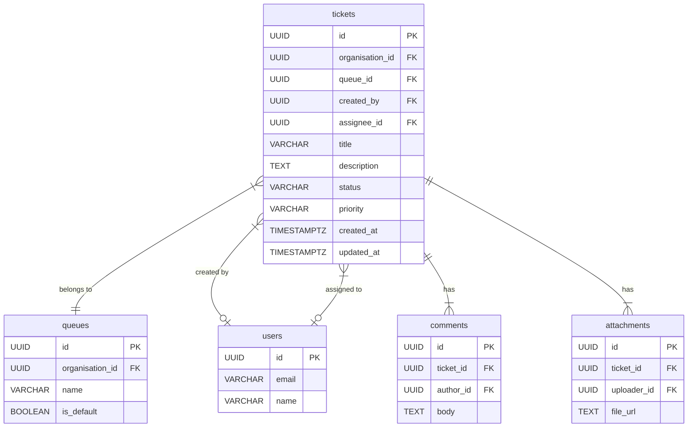

# WorkTrackr Ticket System - Technical Blueprint v1.0

**Date:** November 9, 2025  
**Author:** Manus AI  
**Version:** 1.0

---

## 1. Overview & Purpose

This document serves as the **single source of truth** for the WorkTrackr ticket management system. It details the current implementation, the target production state, and the technical roadmap to bridge the gap. Its purpose is to align all development efforts and ensure a robust, scalable, and maintainable ticketing module.

---

## 2. Current State Analysis (As of Nov 9, 2025)

### 2.1. High-Level Summary

The ticket system is **architecturally sound but functionally broken**. The database schema is well-designed, but the frontend and backend implementations have critical bugs and inconsistencies that prevent the system from working as intended.

### 2.2. What Works ✅

- **Ticket Creation:** Users can create new tickets with a title and description.
- **Ticket Viewing:** Tickets are displayed in a list view with key details.
- **Priority Dropdown:** Changes to ticket priority are correctly saved to the database and persist after refresh.
- **Authentication:** User login and organization-based access control are functional.

### 2.3. What Is Broken or Missing ❌

- **Status Dropdown:** **CRITICAL BUG** - Status changes do not persist. The UI updates, but the API call is never made, so the change is lost on refresh.
- **Queue System:** The backend has a `queues` table, but the frontend does not use it. Tickets do not move between queues based on status changes.
- **Assignment Flow:** Tickets can be assigned, but this does not move them to the assignee's "My Tickets" queue. The "My Tickets" filter is not implemented correctly.
- **SLA Tracking:** The database has SLA fields, but the system does not actively track or display SLA information.
- **Workflow Automation:** The `workflows` table exists, but no automation rules (e.g., auto-assignment, status changes) are implemented.

### 2.4. Root Cause of Current Issues

> The primary bug preventing progress is the **failure of the status dropdown's `onChange` event handler to fire**. Despite the code being identical to the working priority dropdown, the event is not being triggered, which prevents the API call to save the status change. This is the #1 issue to resolve.

---

## 3. Production Target: The Ideal Ticket System

### 3.1. Core Principles

1.  **Status-Driven Workflow:** Ticket status is the engine that drives everything. Changes in status must automatically trigger queue changes, notifications, and SLA updates.
2.  **Clear Ownership:** Every ticket has a clear owner (assignee). The system must make it easy to see who is responsible for what.
3.  **Actionable Queues:** Queues are not just filters; they are actionable worklists. Users should be able to work through their queues efficiently.
4.  **Seamless UI/UX:** The user interface must provide clear, immediate feedback for all actions. Changes must persist reliably.

### 3.2. Target Feature Set

| Feature | Description |
| :--- | :--- |
| **Status Workflow** | Tickets automatically move between `Open`, `In Progress`, `Pending`, `Resolved`, and `Closed` queues based on status. | 
| **Assignment Flow** | Assigning a ticket moves it to the assignee's `My Tickets` queue. Unassigning moves it to the `Unassigned` queue. |
| **Queue Views** | Users can easily switch between `My Tickets`, `Unassigned`, `Open`, `Pending`, `Resolved`, and `Closed` views. |
| **SLA Management** | SLAs are defined and tracked. Visual indicators show tickets that are at risk or have breached their SLA. |
| **Notifications** | Users receive notifications for new assignments, mentions, and SLA breaches. |
| **Comments & Attachments** | Users can add comments and attach files to tickets. |
| **Activity Log** | Every change to a ticket (status, priority, assignment) is logged in an immutable activity trail. |

---

## 4. Database Schema

### 4.1. Entity-Relationship Diagram (ERD)

### 4.2. Key Tables & Columns

**`tickets` Table**

| Column | Type | Description |
| :--- | :--- | :--- |
| `id` | UUID | Primary Key |
| `organisation_id` | UUID | Foreign key to `organisations` table. |
| `queue_id` | UUID | Foreign key to `queues` table. **Currently unused.** |
| `assignee_id` | UUID | Foreign key to `users` table. Defines ticket ownership. |
| `status` | VARCHAR | Current status. Allowed values: `open`, `pending`, `closed`, `resolved`. **`in_progress` is missing from this check constraint!** |
| `priority` | VARCHAR | Current priority. Allowed values: `low`, `medium`, `high`, `urgent`. |

**`queues` Table**

| Column | Type | Description |
| :--- | :--- | :--- |
| `id` | UUID | Primary Key |
| `organisation_id` | UUID | Foreign key to `organisations` table. |
| `name` | VARCHAR | Name of the queue (e.g., "Level 1 Support", "Billing"). |
| `is_default` | BOOLEAN | Whether this is the default queue for new tickets. |

### 4.3. Schema Issues & Gaps

1.  **Missing `in_progress` Status:** The `tickets.status` check constraint is missing the `in_progress` value, even though the `jobs` table has it. This needs to be added.
2.  **No Default Queues:** The `queues` table has an `is_default` flag, but there is no mechanism to create default queues for new organizations.
3.  **No Activity Log Table:** There is no table to store the history of ticket changes, which is critical for auditing and reporting.

---

## 5. Frontend & Backend Workflows

### 5.1. Current Workflow (Broken)

**Changing a Status:**
1.  **User** selects a new status from the dropdown.
2.  **Frontend (React)** updates its local component state, causing the UI to visually change.
3.  **Frontend (React)** `onChange` handler **FAILS TO FIRE** for the status dropdown.
4.  **Backend** The API endpoint `/api/tickets/bulk` is **NEVER CALLED**.
5.  **Database** The ticket status is **NOT UPDATED**.
6.  **On Refresh** The frontend re-fetches data from the backend, and the status reverts to its original value.

### 5.2. Target Workflow (Production)

**Changing a Status to "Closed":**
1.  **User** selects "Closed" from the status dropdown.
2.  **Frontend (React)** `onChange` handler fires.
3.  **Frontend** immediately calls the `bulkUpdateTickets` function, which sends a `PATCH` request to `/api/tickets/bulk` with the payload `[{ id: "...", status: "closed" }]`.
4.  **Frontend** shows a loading spinner and disables the dropdown to prevent further changes.
5.  **Backend** receives the request, validates permissions, and updates the ticket's status in the database.
6.  **Backend** returns a `200 OK` success response.
7.  **Frontend** receives the success response, removes the loading spinner, and shows a success toast ("Ticket moved to Closed queue").
8.  **Frontend** re-fetches the ticket list or intelligently removes the closed ticket from the active view.
9.  **Frontend** The ticket disappears from the "Open" queue, and the "Closed" queue count increments.

---

## 6. Gap Analysis & Technical Roadmap

### Phase 1: Critical Bug Fix (The Status Dropdown)

-   **Task:** Find and fix the root cause of the `onChange` handler not firing for the status dropdown.
-   **Hypothesis:** This is likely a subtle React issue, a conflicting library, or a browser-specific bug. The fastest path to a fix may be to replace the `<select>` element with a custom dropdown component to ensure event handling works reliably.

### Phase 2: Implement Correct Queue Logic

-   **Task:** Modify the frontend `Dashboard.jsx` component to correctly filter tickets based on the target status workflow (`Open`, `In Progress`, `Pending`, `Resolved`, `Closed`).
-   **Task:** Ensure that when a ticket's status is changed, it correctly moves between these queues in the UI.

### Phase 3: Fix the Assignment Flow

-   **Task:** Implement the "My Tickets" filter to correctly show only tickets assigned to the current user.
-   **Task:** Ensure the "My Tickets" count on the dashboard is accurate.
-   **Task:** When a ticket is assigned, it should automatically appear in the assignee's "My Tickets" queue.

### Phase 4: Schema & Backend Enhancements

-   **Task:** Add `in_progress` to the `tickets.status` check constraint in the database.
-   **Task:** Create a database migration to add an `activity_log` table.
-   **Task:** Modify the backend to automatically log all ticket changes to the new `activity_log` table.

### Phase 5: SLA & Automation (Future)

-   **Task:** Implement SLA tracking and display.
-   **Task:** Build the workflow engine to allow for custom automation rules.

---

## 7. Conclusion

The WorkTrackr ticket system has a solid foundation but is plagued by a critical frontend bug. By following this blueprint and prioritizing the fix for the status dropdown, we can quickly get the system into a functional state and then build upon it to achieve the full production target.
